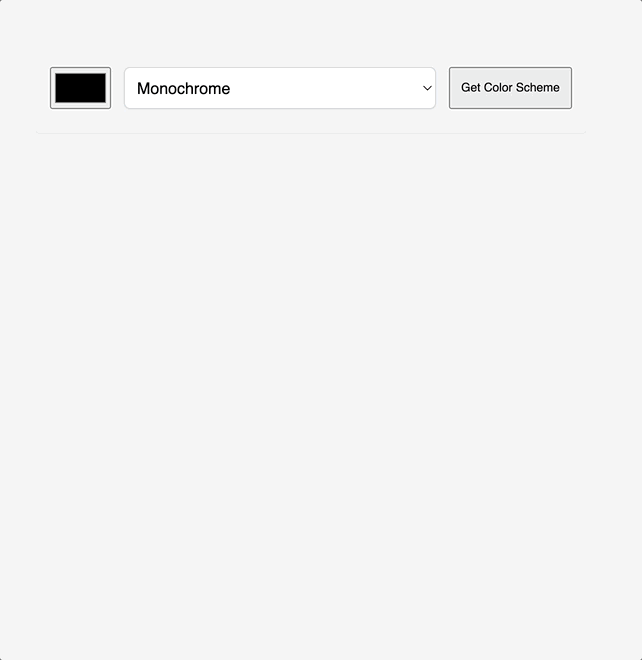

# Color Scheme Generator
Generates five colors based on user's choice of seed color and mode using the [Color API](https://www.thecolorapi.com/)
 [Try it here](https://gilded-cheesecake-3b8383.netlify.app/)

## Intro
A training project built to consolidate key concepts I learned from:

**Module 10 - Working with APIs** [Scrimba Frontend Career Path Course](https://scrimba.com/learn/frontend) 

## Additional Features
-  Copy selected color hex value to clipboard on click

## Demo
 

